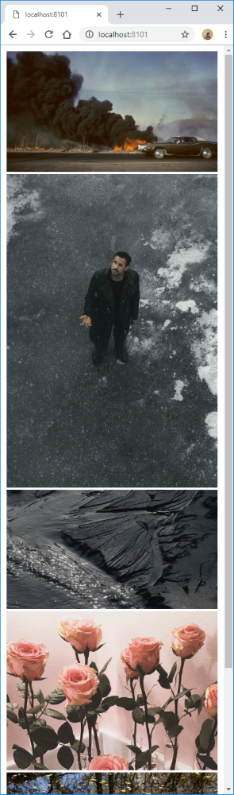

# archillect-animate

A Python app that will create an automatically refreshed web page showing the last X number of images from http://archillect.com

Best efforts are made to make each image a link to the first non-Google-Image source as provided by Archillect's image page.



## Envrionment variables

| Name               | Description                                            | Default              |
|--------------------|--------------------------------------------------------|----------------------|
| SLEEP_SECONDS      | Amount of time to wait between searches for new images | 60                   |
| YIELD_TIME_SECONDS | Amount of time to wait between image page loads        | 5                    |
| RANGE              | Number of recent images to load                        | 5                    |
| INDEX_FILE         | The html file to write                                 | /opt/site/index.html |
| LISTEN_PORT        | The port number that Nginx will listen on              | 80                   |

## Building

```docker build -t fractos/archillect .```

## Running

To use the local port 8101:

```docker run -d --rm -p 8101:80 fractos/archillect``

Then point a browser at:

```http://localhost:8101```

